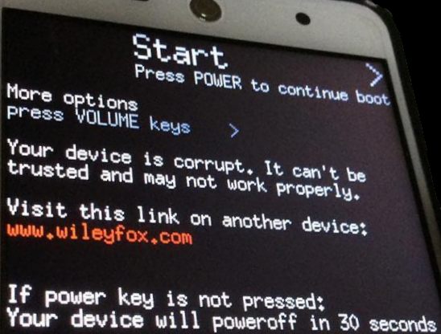

## Corrupted Wileyfox Swift 2

At powering on the device the message below always appears on the screen. Pressing the power key the phone seems to be starting in a normal way and it is possible to use the phone.

It is possible to remove this message in the following way  
* Install Google USB drivers on your desktop [here](https://dl-ssl.google.com//android/repository/latest_usb_driver_windows.zip)
* Install the adb tools on your desktop [here](https://dl.google.com/android/repository/platform-tools-latest-windows.zip)
* Enable developer mode on your phone
* Connect the phone with an usb cable to your desktop
* Verify if phone is 'connected' by executing the command ` adb devices`
* And now execute the command `adb reboot "dm-verity enforcing"` 
* The phone will reboot and the message will be gone
